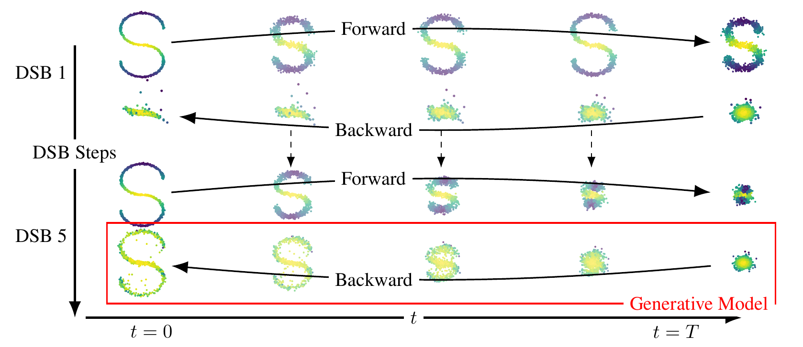

# Diffusion Schr&ouml;dinger Bridge with Applications to Score-Based Generative Modeling

This repository contains the implementation for the paper Diffusion
Schr&ouml;dinger Bridge with Applications to Score-Based Generative Modeling.

If using this code, please cite the paper:
```
    @article{de2021diffusion,
              title={Diffusion Schr$\backslash$" odinger Bridge with Applications to Score-Based Generative Modeling},
              author={De Bortoli, Valentin and Thornton, James and Heng, Jeremy and Doucet, Arnaud},
              journal={arXiv preprint arXiv:2106.01357},
              year={2021}
            }
```

Contributors
------------

*  Valentin De Bortoli  
*  James Thornton
*  Jeremy Heng
*  Arnaud Doucet

What is a Schr&ouml;dinger bridge?
-----------------------------

The Schr&ouml;dinger Bridge (SB) problem is a classical problem appearing in
applied mathematics, optimal control and probability; see [1, 2, 3].  In the
discrete-time setting, it takes the following (dynamic) form. Consider as
reference density p(x<sub>0:N</sub>) describing the process adding noise to the
data.  We aim to find p\*(x<sub>0:N</sub>) such that p\*(x<sub>0</sub>) =
p<sub>data</sub>(x<sub>0</sub>) and p\*(x<sub>N</sub>) =
p<sub>prior</sub>(x<sub>N</sub>) and minimize the Kullback-Leibler divergence
between p\* and p. In this work we introduce **Diffusion Schrodinger Bridge**
(DSB), a new algorithm which uses score-matching approaches [4] to
approximate the *Iterative Proportional Fitting* algorithm, an iterative method
to find the solutions of the SB problem. DSB can be seen as a refinement of
existing score-based generative modeling methods [5, 6].




Installation
------------

This project can be installed from its git repository. 

1. Obtain the sources by:
    
    `git clone https://github.com/anon284/schrodinger_bridge.git`

or, if `git` is unavailable, download as a ZIP from GitHub https://github.com/<repository>.
  
2. Install:

    `conda env create -f conda.yaml`
    
    `conda activate bridge`

3. Download data examples:

    - CelebA: `python data.py --data celeba --data_dir './data/' `
    - MNIST:  `python data.py --data mnist --data_dir './data/' `


How to use this code?
---------------------

3. Train Networks:
  - 2d:  `python main.py dataset=2d model=Basic num_steps=20 num_iter=5000`
  - mnist `python main.py dataset=stackedmnist num_steps=30 model=UNET num_iter=5000 data_dir=<insert filepath of data dir <local paths/data/>`
  - celeba `python main.py dataset=celeba num_steps=50 model=UNET num_iter=5000 data_dir=<insert filepath of data dir <local paths/data/>`

Checkpoints and sampled images will be saved to a newly created directory. If GPU has insufficient memory, then reduce cache size. 2D dataset should train on CPU. MNIST and CelebA was ran on 2 high-memory V100 GPUs.
    

References
----------

.. [1] Hans F&ouml;llmer
       *Random fields and diffusion processes*
       In: École d'été de Probabilités de Saint-Flour 1985-1987

.. [2] Christian Léonard 
       *A survey of the Schr&ouml;dinger problem and some of its connections with optimal transport*
       In: Discrete & Continuous Dynamical Systems-A 2014

.. [3] Yongxin Chen, Tryphon Georgiou and Michele Pavon
       *Optimal Transport in Systems and Control*
       In: Annual Review of Control, Robotics, and Autonomous Systems 2020

.. [4] Aapo Hyv&auml;rinen and Peter Dayan
       *Estimation of non-normalized statistical models by score matching*
       In: Journal of Machine Learning Research 2005

.. [5] Yang Song and Stefano Ermon
       *Generative modeling by estimating gradients of the data distribution*
       In: Advances in Neural Information Processing Systems 2019

.. [6] Jonathan Ho, Ajay Jain and Pieter Abbeel
       *Denoising diffusion probabilistic models*
       In: Advances in Neural Information Processing Systems 2020
